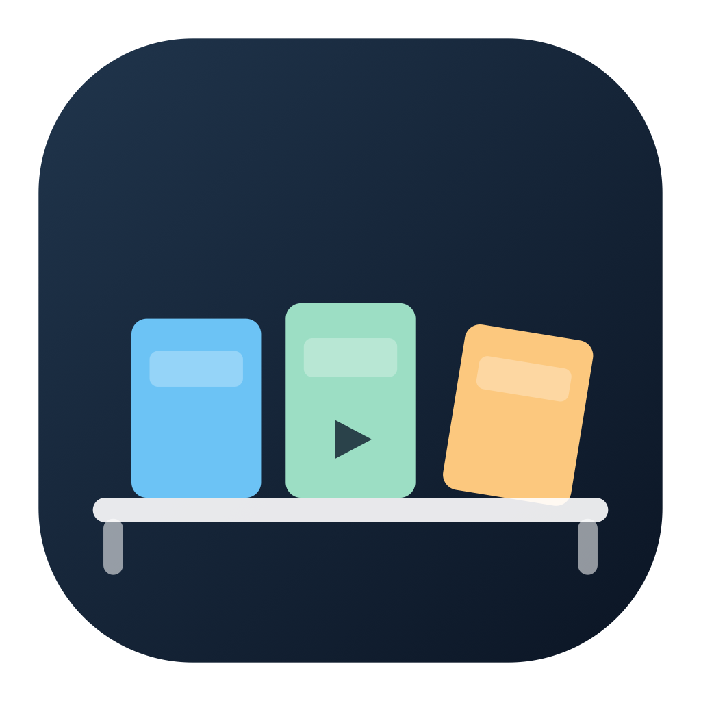
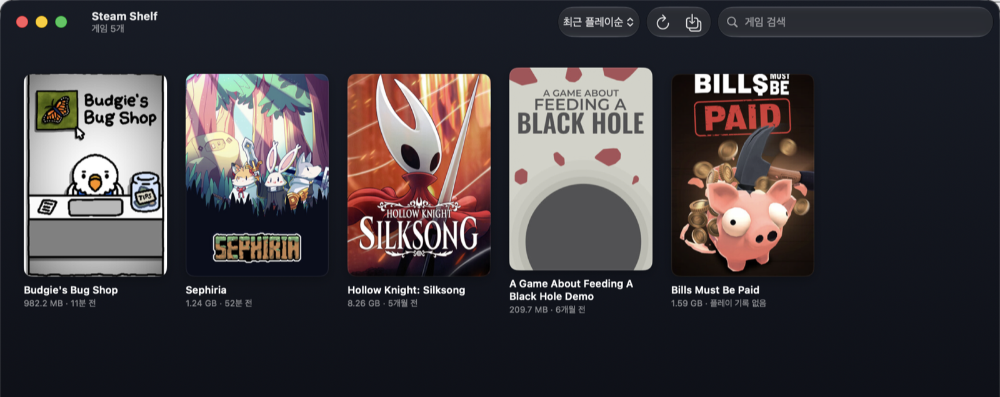

<div align="center">



# Steam Shelf

**설치된 Steam 게임을 macOS 네이티브 앱처럼 실행하세요.**


<a href="LICENSE"></a>

<a href="README.md">English</a>
| **한국어**
| <a href="README.ja.md">日本語</a>
| <a href="README.zh-CN.md">简体中文</a>

</div>

Steam Shelf는 설치된 Steam 게임을 커버아트 그리드로 보여줍니다. 타일을 클릭하면 실행됩니다. 한 번 더 클릭하면 게임마다 실제 `.app`을 `~/Applications`에 만들어, Launchpad와 Spotlight에서 다른 앱처럼 띄울 수 있습니다.

<div align="center">
  
</div>

## 주요 기능

- **커버아트 그리드** — Steam이 디스크에 받아둔 아트워크를 읽습니다. Steam에 아트가 없는 게임은 제목 타일로 표시됩니다.
- **클릭 한 번으로 실행** — `steam://rungameid/<appid>`를 열기 때문에 클라우드 세이브, 플레이 시간, 오버레이가 그대로 동작합니다.
- **게임별 `.app` 바로가기** — 커버아트 아이콘이 붙어 Launchpad·Spotlight에서 바로 실행됩니다.
- **안전한 정리** — 삭제된 게임의 바로가기는 휴지통으로 가고, Steam Shelf가 자기 것이라고 증명할 수 있는 번들만 건드립니다.
- **실시간 반영** — 게임을 설치하거나 지우면 재시작 없이 그리드가 갱신됩니다.
- **다중 라이브러리** — 외장 드라이브 포함.
- **검색과 정렬** — 최근 플레이·이름·용량 순.
- **4개 언어** — English, 한국어, 日本語, 简体中文.
- **네트워크 미사용** — 어떤 연결도 열지 않습니다. 아래 참고.

## 요구 사항

| | |
|---|---|
| OS | macOS 14 Sonoma 이상 |
| Mac | Apple Silicon 또는 Intel |
| 기타 | Steam 데스크톱 클라이언트 |

## 설치

[최신 릴리스](https://github.com/2JIHAN/steam-shelf/releases/latest)에서 `SteamShelf-x.y.z-universal.zip`을 받아 압축을 풀고, **Steam Shelf.app**을 응용 프로그램 폴더로 옮긴 뒤 실행하세요.

### 소스에서 빌드

```bash
git clone https://github.com/2JIHAN/steam-shelf.git
cd steam-shelf
./build.sh                        # → ~/Applications/Steam Shelf.app
./build.sh /Applications          # 다른 위치에 설치
ARCHS=arm64 ./build.sh            # Intel 슬라이스 생략
```

Swift 6 (Xcode Command Line Tools)가 필요합니다. 서명된 릴리스를 만들려면 `NOTARY_PROFILE=<notarytool 프로필> ./release.sh`.

## 사용법

| 동작 | 결과 |
|---|---|
| 타일 클릭 | 게임 실행 |
| 타일 우클릭 | 실행 · 설치 폴더 열기 · 상점 페이지 · AppID 복사 |
| <kbd>⌘</kbd><kbd>R</kbd> | 라이브러리 새로고침 |
| <kbd>⇧</kbd><kbd>⌘</kbd><kbd>S</kbd> | 바로가기 동기화 |
| 검색창 | 게임 이름으로 필터 |
| 정렬 메뉴 | 최근 플레이 · 이름 · 용량 |

## 바로가기 동기화

<kbd>⇧</kbd><kbd>⌘</kbd><kbd>S</kbd>를 누르면 설치된 게임마다 `.app`이 `~/Applications`에 생깁니다. 커버아트로 만든 아이콘이 붙습니다. 파일 이름에 못 쓰는 문자는 치환되어 `Hollow Knight: Silksong`은 `Hollow Knight - Silksong.app`이 됩니다.

동기화가 자기 것으로 인식하는 번들은 두 종류뿐입니다.

| 종류 | 식별 방법 |
|---|---|
| Steam Shelf가 만든 것 | `Info.plist`의 `SteamShelfAppID` 키 |
| Steam의 "Add to Applications"가 만든 것 | `run.sh` 안의 `autogenerated file` 마커 + `steam://run` URL |

`~/Applications`의 나머지 앱은 건드리지 않습니다. 게임이 쓰려는 이름을 일반 앱이 이미 차지하고 있으면 덮어쓰지 않고 건너뛴 뒤 결과에 표시합니다. 삭제된 게임의 바로가기는 휴지통으로 가므로 복구할 수 있습니다.

## 네트워크 미사용

Steam Shelf는 네트워크 연결을 열지 않습니다. 디스크에 있는 Steam 파일을 읽고 URL 스킴으로 게임을 실행할 뿐, 밖으로 나가는 것이 없습니다. 텔레메트리도, 업데이트 확인도, 아트워크 다운로드도 없습니다.

직접 검사해보실 수 있습니다.

```bash
./verify-no-network.sh --runtime
```

| 층 | 검사 |
|---|---|
| 소스 | `URLSession`·`NWConnection`·소켓 없음. 허용 목록 밖의 원격 주소 없음 |
| 바이너리 | `CFNetwork`·`Network.framework` 링크 없음, 네트워킹 심볼 참조 없음 |
| 실행 중 | 실행된 앱이 연 소켓 0개 |

핵심은 바이너리 검사입니다. 소스 grep은 우회할 수 있지만, 네트워크에 닿는 코드는 어떤 경로로 짜든 `CFNetwork`를 끌고 오고 그건 `otool -L`에 드러납니다. CI가 푸시마다 정적 검사를 돌립니다.

허용 목록에 든 주소는 하나뿐입니다 — 우클릭 메뉴의 **상점 페이지 열기**가 쓰는 `store.steampowered.com`. `NSWorkspace`로 URL을 브라우저에 넘기는 것이라 앱 자신은 접속하지 않습니다.

## 지원 언어

시스템 언어를 따르고, 없는 언어는 영어로 표시됩니다. 언어를 추가하려면 `Resources/en.lproj/Localizable.strings`를 `Resources/<코드>.lproj/`로 복사해 각 줄의 오른쪽만 번역하고, `build.sh`의 `CFBundleLocalizations`에 코드를 추가하면 됩니다. Swift 코드는 손댈 필요가 없습니다.

## 프로젝트 구조

```
Sources/
  App.swift            앱 진입점, 메뉴 명령
  ContentView.swift    그리드 UI, 게임 타일, 동기화 결과 문장
  Store.swift          상태 관리, 커버 로딩, 폴더 감시
  SteamLibrary.swift   라이브러리·매니페스트 스캔
  Artwork.swift        커버 조회, .icns 생성
  ShortcutSync.swift   .app 바로가기 생성과 정리
  VDF.swift            Steam KeyValues 파서
Resources/             en, ko, ja, zh-Hans .lproj
build.sh               빌드 스크립트
release.sh             서명·공증·패키징
verify-no-network.sh   네트워크 연결이 없는지 검사
```

## 자주 묻는 질문

### Steam이 실행되어 있어야 하나요?

네. Steam Shelf는 클라이언트에서 플레이 버튼을 누르는 것과 똑같이 Steam에 실행을 요청합니다. 그래야 클라우드 세이브, 도전 과제, 플레이 시간, 오버레이가 정상 동작합니다. Steam이 꺼져 있으면 자동으로 켜집니다.

### 바로가기 동기화를 눌러도 안전한가요?

Steam Shelf 마커나 Steam의 autogenerated 마커가 있는 번들만 제거 대상이며, 제거는 휴지통 이동입니다. 다른 앱은 `Info.plist`를 읽는 것 외에 건드리지 않습니다.

### Steam 외 게임도 지원하나요?

아니요. Steam의 매니페스트를 읽으므로 Steam으로 설치한 게임만 나타납니다. 보조 라이브러리나 외장 드라이브의 Steam 게임은 정상 동작합니다.

## 라이선스

[MIT](LICENSE)
